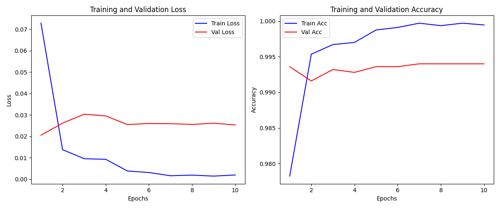
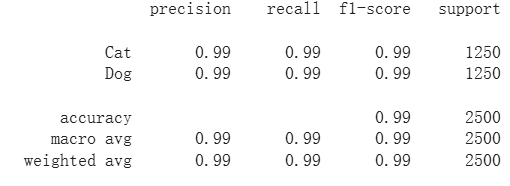
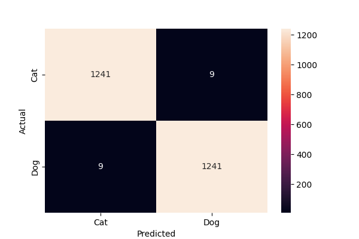
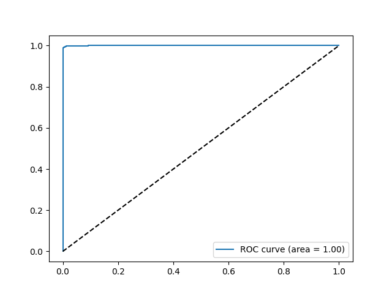

## 安裝步驟
1. 複製專案: `git clone https://github.com/ChangWeiChen1225/cat_vs_dog.git`
2. 進到專案: `cd cat_vs_dog`
3. 安裝環境: `pip install -r requirements.txt`
4. 下載資料集: https://www.kaggle.com/competitions/dogs-vs-cats/data (務必將.zip檔放到專案資料夾)

## 如何執行
#### Option 1. 執行自動化腳本即可完成資料準備-->訓練-->驗證：
```
bash run.sh
```
#### Option 2. 輸入以下指令依序完成：
* 建置環境
```
pip install -r requirements.txt
```
* 資料準備
```
python data_setup.py --src_train_dir train --base_dir data --split_ratio 0.1 --seed 42
```
* 進行訓練
```
python train.py --epochs 15 --batch_size 128 --lr 0.001 --save_path ./checkpoints/best_model.pth
```
* 進行測試集驗證
```
python eval.py --model_path ./checkpoints/best_model.pth
```

## 步驟說明
#### 1. 資料準備 (Data setup)
* 由於test1資料集並沒有提供label，因此需要從train資料集中分出train set、val set、test set
* 資料切分比例 train : val : test = 8 : 1 : 1
* 將data放成以下資料夾結構:
```
project
└───data
    └───train
    │   └───cat
    │   │   │   cat21.jpg
    │   │   │   cat32.jpg
    │   │   │   ...
    │   │
    │   └───dog
    │       │   dog05.jpg
    │       │   dog11.jpg
    │       │   ...
    │
    └───val
    │   └───cat
    │   └───dog
    │
    └───test
        └───cat
        └───dog


```

#### 2. 訓練 (Training)
* 將圖片resize成固定大小，並做Data Augmentation
* 設定損失函數以及優化器
* 建立迴圈做迭代訓練: 每個epoch進行一次train以及evaluate
* 每個epoch迴圈做checkpoint，儲存訓練進度，以防訓練中斷
* 訓練結束繪製training curve

#### 3. 驗證 (Evaluation)
* 導入表現最好的權重檔 (best_model.pth)
* 使用test set進行最終的表現測試
* 顯示最終的 accuracy, precision, recall, F1-score
* 繪製confusion metrix以及ROC curve

## 模型架構與技術決策
* **Backbone**: ResNet50 (Pre-trained on ImageNet: IMAGENET1K_V2)。
  * ResNet50 透過殘差結構（Residual Blocks）解決了深層網路的梯度消失問題，在 ImageNet 上已具備極強的影像識別能力。
* **Modification**: 替換 FC 層，加入 Dropout (0.5) 與 ReLU。
  * Dropout (0.5) 以有效抑制過擬合，ReLU 激活函數增加非線性表達力，最後針對二分類（貓/狗）重新設計輸出層。
* **Optimization**: optimizer使用AdamW，搭配 `ReduceLROnPlateau` 動態調整學習率。
  * ReduceLROnPlateau 會監控 Validation Loss，當損失不再下降時自動調低學習率，能讓模型在最後階段更精細地更新權重。

## 實驗結果 (Results)
**Learning_curves**
<br>
*觀察：模型在第 5 個 Epoch 達到收斂，驗證集準確率約為 99.3%。*

**Evaluation performance**
<br>
**高度泛化能力**：在完全未見過的測試資料上取得 99% 的準確率，顯示模型具備優異的泛化能力。<br>
**極致的類別平衡**：測試集樣本分佈平均 (1250:1250)，且兩類別的 F1-Score 均為 0.99，模型對貓與狗的特徵辨識能力相當均衡，無明顯類別偏見。

**Confusion metrix**
<br>
*觀察：利用 Confusion matrix 可以看出各類別的錯判狀況。*

**ROC curve**
<br>
*觀察：利用計算 ROC curve 的曲線下面積得出 AUC 約等於 1。*

## 訓練環境資源狀態 (Hardware Utilization)

使用Colab在模型正式訓練期間，硬體資源即時監控數據如下：

* **系統 RAM**: 3.6 / 12.7 GB (佔用率約 28%)
* **GPU RAM (Tesla T4)**: 12.3 / 15.0 GB (**佔用率約 82%**)
* **磁碟空間**: 45.4 / 112.6 GB
* **後端環境**: Python 3 Google Compute Engine (GPU)

**優化觀察**：
1. **GPU 利用率優化**：觀察到 GPU RAM 佔用已達 12.3GB (82%)，顯示目前的 `batch_size` 設定已接近硬體極限，能有效發揮 Tesla T4 的並行運算效能。
2. **內存穩定性**：系統 RAM 保持在低水位 (28%)，代表資料預處理流程（Data Loader）並未造成內存溢出，整體 Pipeline 設計穩定。
3. **硬體適配性**：目前的模型架構與參數設定非常適合在 16GB 顯存規格的 GPU 上運行，既保證了訓練效率，也預留了足夠的 Buffer 空間防止 OOM (Out of Memory) 錯誤。
